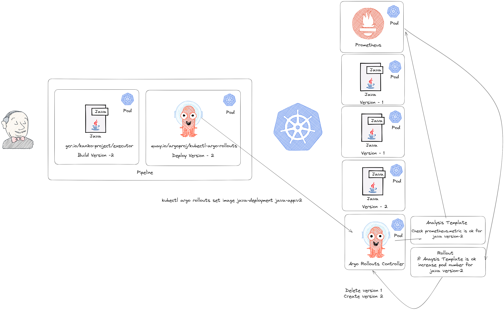

# DevOps Engineering Case

## Requirements

### Step A

- Containerize sample-java-app. Create Dockerfile for the application using multi-stage builds.

### Step B

- Create a production ready Kubernetes Cluster.
- Deploy Jenkins
  - Jenkins should be installed on only Node 3.
- Deploy Elasticsearch on K8s for Kubernetes & application logging purposes.
  - Create Log indexes for Kubernetes application.
  - Configure Kibana so that it can be accessed from the internet with authentication.
- Deploy Prometheus & Grafana on K8s for Kubernetes and application monitoring purposes.
  - Create specific Grafana dashboards for Kubernetes and applications.

### Step C

- Create the required Kubernetes manifests (deployment, service, ingress, secret, hpa, etc.)
- The application should run on both worker nodes with at least 4 pods, and service will be balanced behind the nginx.
  - Make sure pods are distributed equally across nodes
- Ensure the application receives requests as soon as it is ready and restarted if there is a problem.
- Create a build pipeline for the application via Jenkinsfile.
  - The created docker image should be deployed on DockerHub.
- Create a deploy pipeline for the application via Jenkinsfile.
  - Deploy Kubernetes manifests via Ansible.
- Write a custom validation webhook so that if a deployment does not have resource requests specified, it should fail.
- What would you do if you were to have canary deployments? Which tool would you use? How would you manage it through the pipeline? Please explain.

## Step 1 - Containerize sample-java-app

### Fork the repo

The [sample-java-app](https://github.com/SampleJavaApp/app) application was forked to my own Github account. I pulled the code to my working environment in WSL (Windows Subsystem for Linux) and tested the application in a Docker container. I determine the Java version of the Docker container in which I will run the application from the pom.xml file in the code.

```xml
<description>Demo Java App for DevOpsCase Studies</description>
<properties>
    <java.version>11</java.version>
</properties>
```

I choose  [**Amazon Coretto**](https://hub.docker.com/_/amazoncorretto) from the Docker images for OpenJDK 11. This is because Amazon Corretto is a cloud-optimized, performance-focused, free and secure OpenJDK distribution with ongoing support.

### Writing the Dockerfile

The image for OpenJDK 11 from the Amazon Corretto repository is pulled. Since it's a multi-stage Dockerfile, the build stage is defined.

```Dockerfile
FROM  amazoncorretto:11 as build
```

The working directory of the application is specified. The files within the project are copied to the directory specified in the image.

```Dockerfile
WORKDIR /app
COPY ./ /app/
```

The execute permission is granted to Maven Wrapper. Maven Wrapper is a tool that automatically downloads and uses a specific version of Maven for the Maven project.

To package the Maven project, the command ./mvnw package is executed. This command compiles the project source code and packages the project output into an executable file or a JAR file.

```Dockerfile
RUN chmod +x mvnw
RUN ./mvnw package
```

After creating the JAR file and making the project runnable, the image for the application is determined. Due to its small size, faster download and distribution processes, and security advantages, the amazoncorretto:11-alpine image is selected.

```Dockerfile
FROM  amazoncorretto:11-alpine-jdk
WORKDIR /app
```

In the previous stage, the JAR file is copied into this image, leaving all unnecessary files and build-time dependencies in the previous image and keeping only the required files for runtime in the final image.

```Dockerfile
COPY --from=build /app/target/app-0.0.1-SNAPSHOT.jar ./
```

The port on which the image will run is specified, and the JAR file is executed. It is important to note that expose does not open the container to the outside. It is specified in the Dockerfile for documentation purposes.

```Dockerfile
EXPOSE 9001/tcp
CMD [ "java", "-jar", "app-0.0.1-SNAPSHOT.jar" ]
```

You can click [here](./java-app/Dockerfile) to examine the Dockerfile.

## Step 2 - Create Production Ready Kubernetes Cluster

>First, I performed the installation with a virtual machine cluster using Vagrant and VirtualBox. However, due to my desktop PC having only 16GB of RAM, I encountered resource problems in later steps. After the installation of Prometheus and Grafana, I ran out of memory and CPU cores while trying to install the application. As a result, I decided to set up the entire cluster again on Google Cloud Platform (GCP).

### Create k8s Cluster

Three machines were deployed on GCP Compute Engine. The first machine had 4 cores and 8GB of RAM, while the other two machines had 2 cores and 4GB of RAM each. All machines were running the Ubuntu 20.04 LTS Linux distribution.


The hostnames were set as follows:

    k8s-master: The master node
    node-1: The first worker node
    node-2: The second worker node

After setting the hostnames, network connectivity between the machines was tested, and it was observed that they could ping each other successfully. To allow communication for Kubernetes components and applications, the necessary ports were opened using UFW (Uncomplicated Firewall) on each machine.

for k8s-master:

```sh
ufw allow 6443/tcp # Kubernetes API server
ufw allow 2379:2380/tcp # etcd server client API
ufw allow 10250/tcp # Kubelet API
ufw allow 10259/tcp # kube-scheduler
ufw allow 10257/tcp # kube-controller-manager
```

for node-1 and node-2:

```sh
ufw allow 10250/tcp
ufw allow 30000:32767/tcp
```

To avoid performance issues, memory swap has been disabled.

```sh
swapoff -a
```

> After a reboot, the swap is re-enabled. To prevent this, disabling swap permanently should be done on Ubuntu distributions.

There are two modules used by Kubernetes and container technologies in Linux that need to be activated.

```sh
modprobe overlay #storage driver
modprobe br_netfilter # nat for bridge networking
```

To enable Linux machine to forward incoming network traffic to other network interfaces for different destinations, the following settings should be configured.

```sh
sudo nano /etc/sysctl.d/k8s.conf # Open the k8s.conf file with the nano text editor.
```

```sh
net.bridge.bridge-nf-call-ip6tables = 1
net.bridge.bridge-nf-call-iptables = 1
net.ipv4.ip_forward = 1
```

```sh
sudo sysctl -p /etc/sysctl.d/k8s.conf 
```

This command applies the changes made in the k8s.conf file so that the new network settings take effect without the need for a system reboot.

Once the necessary environment for container technologies is set up, the installation of the Container Runtime begins. Kubernetes withdrew its support for Docker as the container runtime two years ago, so a different runtime needs to be used.

containerd, developed by Docker, is used to manage container execution processes and perform fundamental container operations such as creation, running, stopping, and deletion. Kubernetes still supports containerd, making it the chosen container runtime for Kubernetes.

```sh
wget https://github.com/containerd/containerd/releases/download/v1.7.2/containerd-1.7.2-linux-amd64.tar.gz
tar Cxzvf /usr/local containerd-1.7.2-linux-amd64.tar.gz
```

To start containerd using systemd and turn it into a Linux system service, you need to create a systemd service unit file.

```sh
wget https://raw.githubusercontent.com/containerd/containerd/main/containerd.service
sudo mv containerd.service /etc/systemd/system
sudo systemctl daemon-reload
sudo systemctl enable --now containerd
```

To achieve proper resource management and avoid potential performance and stability issues, it is important to ensure that both the Kubelet service and containerd use the same cgroup driver. In our Ubuntu system, where systemd is used as the system init, we will assign systemd as the cgroup driver for both components.

```sh
containerd config default > config.toml
sudo mkdir -p /etc/containerd/
sudo mv config.toml /etc/containerd/
nano /etc/containerd/config.toml
```

```sh
SystemdCgroup = true
```

```sh
sudo systemctl restart containerd
```

Both runc and CNI plugins play critical roles in containerd and Kubernetes. runc handles the low-level container execution, while CNI plugins take care of container networking, ensuring that containers can communicate with each other and the external world as needed. runc and CNI plugins are also installed for the proper functioning of containerd and Kubernetes.

```sh
sudo apt-get install runc
wget https://github.com/containernetworking/plugins/releases/download/v1.3.0/cni-plugins-linux-amd64-v1.3.0.tgz
sudo  mkdir -p /opt/cni/bin
sudo tar Cxzvf /opt/cni/bin cni-plugins-linux-amd64-v1.3.0.tgz
```

After performing these tasks on all three machines, Kubeadm can be installed. Kubeadm is used to set up a Kubernetes cluster by connecting the Kubernetes nodes together.

```sh
sudo mkdir  -p /etc/apt/keyrings/  #In newer versions of Ubuntu, this directory does not exist; you can create it manually.
sudo apt-get update
sudo apt-get install -y apt-transport-https ca-certificates curl
curl -fsSL https://dl.k8s.io/apt/doc/apt-key.gpg | sudo gpg --dearmor -o /etc/apt/keyrings/kubernetes-archive-keyring.gpg
echo "deb [signed-by=/etc/apt/keyrings/kubernetes-archive-keyring.gpg] https://apt.kubernetes.io/ kubernetes-xenial main" | sudo tee /etc/apt/sources.list.d/kubernetes.list
sudo apt-get update
sudo apt-get install -y kubelet kubeadm kubectl
sudo apt-mark hold kubelet kubeadm kubectl
```

To ensure that Kubelet uses systemd as the cgroup driver and the container runtime endpoint is set to containerd, we create the default kubelet configuration file and define kubelet extra arguments.

```sh
sudo nano /etc/default/kubelet
```

```sh
KUBELET_EXTRA_ARGS="--cgroup-driver=systemd --container-runtime-endpoint=unix:///run/containerd/containerd.sock"
```

```sh
systemctl daemon-reload && systemctl restart kubelet
```

The machine named k8s-master, which serves as the master node, is initialized as the control plane by running the command kubeadm init.

```sh
kubeadm init --pod-network-cidr=192.168.0.0/16 --apiserver-advertise-address=10.166.0.2 --control-plane-endpoint=10.166.0.2 #The reason for setting the pod network to 192.168.0.0/16 is that Calico will be used as the network plugin for Kubernetes.
```

After running this command, the k8s-master machine will be initialized as the control-plane for the Kubernetes cluster. Kubeadm will output the necessary token and command for other nodes to join this Kubernetes cluster.

By running this command on the other nodes, they will join the Kubernetes cluster and become part of it.

```sh
kubeadm join 10.166.0.2:6443 --token ******** --discovery-token-ca-cert-hash sha256:*****
```

To be able to use kubectl without using sudo, the kubeconfig file is added to the path for the user with root privileges.

```sh
mkdir -p $HOME/.kube
sudo cp -i /etc/kubernetes/admin.conf $HOME/.kube/config
sudo chown $(id -u):$(id -g) $HOME/.kube/config
export KUBECONFIG=$HOME/.kube/config
```

```sh
kubectl get nodes
```

In the Kubernetes cluster, the nodes may be visible, but without a pod network plugin, they appear as '*not ready*,' rendering them unusable.

[Calico](https://docs.tigera.io/calico/latest/getting-started/kubernetes/) is a popular network policy and management solution often preferred for Kubernetes installations. It enhances container infrastructure by providing essential advantages such as network segmentation, security, and scalability. Therefore, Calico will be used for Kubernetes container network configuration.

```sh
kubectl create -f https://raw.githubusercontent.com/projectcalico/calico/v3.26.1/manifests/tigera-operator.yaml
kubectl create -f https://raw.githubusercontent.com/projectcalico/calico/v3.26.1/manifests/custom-resources.yaml
```

Calico fine-tunes and sets up the network configuration within Kubernetes for us. We can define various settings, including the pod subnet, through the custom-resources.yaml file. To verify that Calico and the Kubernetes network are ready, we can run the following commands and examine their outputs.

```sh
kubectl get pods -n calico-system
kubectl get nodes -o wide 
```

Since a production-ready cluster with high availability is desired on the master node, the control plane taint should not be removed. Instead, additional control plane nodes should be added to achieve high availability and fault tolerance.Since resource constraints prevent deploying multiple masters, the cluster will proceed with a single master node to achieve a production-ready setup with limited availability.

The roles of other nodes are defined as workers.
> Making this definition is not mandatory. However, it is recommended to define the roles both for indicating the tasks of the nodes and for using it in assignment through labels.

```sh
sudo kubectl label nodes node-1 kubernetes.io/role=worker
sudo kubectl label nodes node-2 kubernetes.io/role=worker
```

Once the Kubernetes cluster is ready and set up, you can start deploying your applications using Deployment objects.

### Deploy Jenkins

A namespace named "jenkins" has been created on Kubernetes.

```sh
kubectl create namespace jenkins
```

[jenkins-deployment.yaml](./jenkins/jenkins-deployment.yaml) and [jenkins-service.yaml](./jenkins/jenkins-service.yaml) files have been created.

Jenkins application has been exposed outside the cluster as a NodePort service. The necessary ports on the GCP firewall have been opened to allow access to the nodes.

```yaml
spec:
  type: NodePort
  ports:
    - name: httpport
      port: 8080
      targetPort: 8080
      nodePort: 30000
    - name: jnlpport
      port: 50000
      targetPort: 50000
```

The label usage in the Jenkins deployment definition ensures that Jenkins is deployed on node-2. Labels are used to select specific nodes based on key-value pairs, allowing you to target deployments to specific nodes in the Kubernetes cluster. By using the appropriate label, Jenkins is guaranteed to be deployed on node-2.

```yaml
nodeSelector:
    pool: jenkins
```

```sh
kubectl label nodes node-2 pool=jenkins
```

Node-2 node has been labeled with the pool=jenkins label.

To continue the Jenkins installation, you can access the Jenkins web interface by going to the external IP of the GCP machine on the specified NodePort.

To obtain the Jenkins installation token, you need to examine the logs of the Jenkins pod.

```sh
kubectl logs jenkins-6cdcccdc79-hd9k9 -n jenkins
```

The installation continues after entering the Jenkins token.


### Deploy EFK Stack

To set up a Kibana deployment with a login screen, Xpack security needs to be enabled. Suitable YAML files were created for this purpose.

Elasticsearch infrastructure was set up with [data](./efk/data/es-data-statefulset.yaml), [master](./efk/master/es-master-deployment.yaml) and [coordinating](./efk/client/es-client-deployment.yaml) (client) nodes according to Elasticsearch's structure.

Considering the stateful nature of the data node, it was defined as a StatefulSet. Persistent Volume Claim is defined in Statefulset object, so a [local-storage class](./efk/storageclass.yaml) and [persistent volume](./efk/pv.yaml) were created. The node's file directory was preferred for the Persistent Volume (other storage solutions on GCP can also be utilized if needed).

To be cautious about resource usage, Fluentbit was chosen instead of Fluentd for log collection, as it is lighter and faster. Fluentbit was designed as a [DaemonSet](./efk/fluentbit/fb-ds.yaml) for automatic deployment on each node. A [ClusterRole](./efk/fluentbit/fb-role.yaml) was created for this purpose.

After applying the [Elasticsearch YAMLs](./efk/), access to the relevant pod was established to set up a password, and the passwords were documented.

```sh
kubectl exec -it $(kubectl get pods -n logging | grep elasticsearch-client | sed -n 1p | awk '{print $1}') -n logging -- bin/elasticsearch-setup-passwords auto -b
```

The passwords were saved as secrets to enable Fluentd and Kibana pods to use them.

```sh
kubectl create secret generic elasticsearch-pw-elastic -n logging --from-literal password=***
```

After applying the [Kibana YAML](./efk/kibana/) files, access to the Kibana UI was opened via the NodePort that was exposed using GCP firewall rules. Users accessed the Kibana UI using the password of the Elastic user.


After applying the [Fluentbit YAML](./efk/fluentbit/) files, the pods running on each node started to send data to Elasticsearch, and this data can now be monitored through Kibana.


### Deploy Prometheus and Grafana

Helm, the Kubernetes package manager, was used for the deployment of Prometheus and Grafana.

```sh
sudo apt-get install helm
helm repo add prometheus-community https://prometheus-community.github.io/helm-charts
helm install prometheus prometheus-community/prometheus
kubectl expose service prometheus-server --type=NodePort --target-port=9090 --name=prometheus-server-ext
```

>After the installation of Prometheus using Helm, it was observed that there was a persistent volume claim. The deployment was edited to use the local-storage class for the persistent volume claim. Subsequently, a [persistent volume](./prograf/pv-2.yaml) was created on node-2 in a specific directory.
> ```kubectl edit deployment prometheus-server```

Access to the Prometheus dashboard was achieved through the relevant NodePort. Now, the installation of Grafana is initiated.


```sh
helm repo add grafana https://grafana.github.io/helm-charts
helm repo update
helm install grafana grafana/grafana
kubectl expose service grafana --type=NodePort --target-port=3000 --name=grafana-ext
kubectl get secret --namespace default grafana -o jsonpath="{.data.admin-password}" | base64 --decode ; echo #get admin password
```

After opening the relevant NodePort through the GCP Firewall, access to Grafana was established via the specified port, and login was successful using the obtained password.


A Kubernetes-specific default dashboard was imported into Grafana. Prometheus was added as a data source. The dashboard was created and modified accordingly.


## Step 3 - Deploy Java App to Kubernetes

YAML files for various Kubernetes objects like [HPA](./java-app/java-app-hpa.yaml), [Ingress](./java-app/java-app-ingress.yaml), [Secret](./java-app/java-app-secret.yaml), and [Deployment](./java-app/java-app-deployment.yaml) were created for the Java application. These YAML files were placed under the "java-app" directory in the forked repository. The Secret YAML file was applied on the machine but not included in the repository.

> Kubernetes Horizontal Pod Autoscaler (HPA) requires the Metrics Server to function properly, so the installation of Metrics Server was performed using Helm.
> 
> ```helm repo add metrics-server https://kubernetes-sigs.github.io/metrics-server```
> 
> ```helm repo update```
>
> ```helm install metrics-server metrics-server/metrics-server -n  kube-system```

To achieve load balancing with Nginx, the nginx-ingress-controller was installed.

```sh
helm repo add nginx-stable https://helm.nginx.com/stable
helm repo update
helm install nginx-ingress nginx-stable/nginx-ingress --set rbac.create=true
```

By specifying the nginx-ingress-controller in the Ingress configuration for the Java app, the nginx-ingress-controller was automatically exposed to the outside world via NodePort.

```yaml
spec:
  ingressClassName: nginx
```


To ensure that the application runs equally on all worker nodes, a node selector was specified in the deployment object. This node selector allows the deployment to be scheduled only on nodes that have the specified label.

```sh
kubectl label nodes node-1 app=java-app
kubectl label nodes node-2 app=java-app
```

```yaml
nodeSelector:
    app: java-app
```

The readiness and health checks for the application were specified in the deployment object. Since there are no separate API endpoints for health and readiness checks, they were both directed to the same endpoint. By defining readiness and health checks, Kubernetes can monitor the health of the application and ensure that it is ready to receive traffic.

```yaml
readinessProbe:
    httpGet:
    path: /api/foos?val=imok
    port: 9001
    initialDelaySeconds: 10
    periodSeconds: 10
livenessProbe:
    httpGet:
    path: /api/foos?val=imok
    port: 9001
    initialDelaySeconds: 10
    periodSeconds: 15
    failureThreshold: 3
```

The Jenkins pipeline writing phase started once the application deployment was ready.
To enable Jenkins to use Kubernetes pods as pipeline agents, a Jenkins [service account](./jenkins/jenkins-service-account.yaml) was created with the [necessary permissions](./jenkins/jenkins-service-account.yaml). The secret for the created service account was noted down, and the Jenkins-Kubernetes connection was established using the Kubernetes plugin. This allows Jenkins to dynamically provision and use Kubernetes pods to execute the pipeline steps, providing a scalable and flexible way to build, test, and deploy applications.


In the Kubernetes-based(running in container) Jenkins environment, [Kaniko](https://github.com/GoogleContainerTools/kaniko) container is used for building container images without requiring access to the Docker daemon. A Kaniko pod template is created on Jenkins to enable building images using Kaniko. To allow Kaniko to interact with the Docker registry, DockerHub credentials are added to the Jenkins credential store as secrets. This ensures that Jenkins can securely authenticate and push the built images to DockerHub or any other container registry specified in the pipeline. Kaniko's ability to build images inside the Kubernetes cluster makes it a suitable choice for container image building in this environment.


The next step in the pipeline involves connecting to the running Jenkins pod and installing Ansible. Additionally, the necessary Kubernetes libraries are installed within the Ansible environment to enable interaction with the Kubernetes cluster.

```sh
kubectl exec -it jenkins -n jenkins bash
```

```sh
apt install pip
pip install ansible
ansible-galaxy collection install kubernetes.core
```

An Ansible [playbook](./ansible/playbook.yaml) has been written to handle the deployment of the Java application. To enable Ansible to perform the deployment, a [service account](./ansible/ansible-service-account.yaml) was created with the [necessary permissions](./ansible/ansible-role-binding.yaml). From this service account, a kubeconfig file was generated and added to the Jenkins Credential store. This kubeconfig file allows Ansible to authenticate with the Kubernetes cluster and perform the desired deployment tasks.


The [Jenkins pipeline](./jenkins/Jenkinsfile) has been implemented as a two-stage pipeline.


A DNS record for java-app.local has been added, pointing to the external IP address of the VM where the nginx-ingress-controller is running. This allows us to test that the application is running behind the Ingress and accessible via the specified domain name (java-app.local). Users can now access the Java application by navigating to http://java-app.local:nodePort in their web browsers. The nginx-ingress-controller will route the incoming traffic to the appropriate Kubernetes service, which will then forward the requests to the Java application running in the pods.


This ensures that the Ingress is correctly routing the incoming traffic to the Java application running in the Kubernetes cluster, and the nginx-ingress-controller is functioning as expected, handling the external access to the application.

### Deployment Validation

[A webhook-listening service](./deployment_validate/app.py) for deployment validation was developed using Python Flask. It was [containerized](./deployment_validate/Dockerfile) and deployed to the Kubernetes cluster, and the [webhook admission](./deployment_validate/validate_webhook.yaml) was directed to this service.

Since the webhook admission object communicates only over HTTPS, a self-signed TLS certificate was created and applied to the Flask service and the webhook admission object.

```sh
mkdir certs
openssl genrsa -out certs/tls.key 2048
openssl req -new -key certs/tls.key -out certs/tls.csr -subj "/CN=webhook-server.production.svc"
openssl x509 -req -extfile <(printf "subjectAltName=DNS:webhook-server.production.svc") -in certs/tls.csr -signkey certs/tls.key -out certs/tls.crt
ENCODED_CA=$(cat certs/tls.crt | base64 | tr -d '\n')
```

```sh
nano webhook-server-deployment.yaml
```

```sh
caBundle: $ENCODED_CA
```

```sh
kubectl create -f webhook-server-deployment.yaml 
kubectl create -f validate-webhook.yaml 
```

A deployment without the 'Requests' field is tested for validation, the following output was obtained.


### Canary Deployment



To use different deployment strategies like Blue-Green and Canary Deployment, I would start by setting up an Argo Rollouts controller in the Kubernetes cluster. Then, as we currently have, I would create a Jenkins pod template. Inside the pod template, I would include kubeconfig credentials to execute kubectl commands. However, just using the kubectl command might not be enough, so I would also add the quay.io/argoproj/kubectl-argo-rollouts:master container, which contains the Kubernetes Argo Rollouts plugin.

Next, I would create an AnalysisTemplate using the Argo Rollouts controller. Within this AnalysisTemplate, I would define success conditions. This would allow me to increase the canary deployment pod ratio when certain metrics meet positive conditions. The success conditions could be based on metrics obtained from Prometheus, for example.

In the Jenkins pipeline, after building the image, I would call the kubectl-argo-rollouts container to initiate the rollout and change the image version. Subsequently, I would monitor the deployment based on the metrics defined in the AnalysisTemplate to determine whether the rollout was successful.
